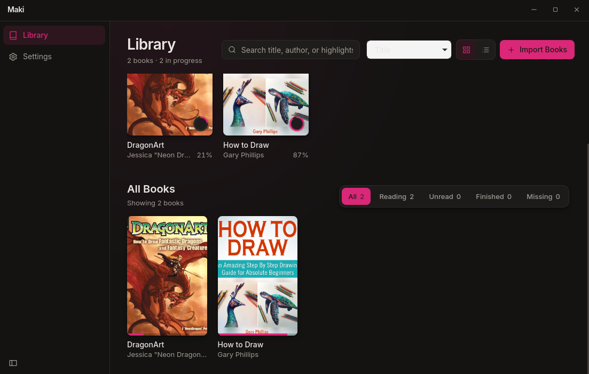

<div align="center">


# Shiori 栞

**A beautiful, fast ebook reader for Linux.**

[](LICENSE)
[](https://aur.archlinux.org/packages/shiori)
[](https://github.com/ovyas24/shiori/actions/workflows/ci.yml)
[](https://github.com/ovyas24/shiori/releases/latest)

<!-- SCREENSHOT: docs/screenshots/hero.png — the library grid in dark mode,
     ~10 books with real covers, the "Continue Reading" row with progress
     rings visible at the top, window ~1280×800. -->


</div>

Shiori (栞, Japanese for *bookmark*) brings an Apple Books-quality reading
experience to the Linux desktop: real covers everywhere, careful typography,
smooth and quiet interactions — and no cloud attached.

## Features

**Library**

- 📚 Grid and list views with cover art, instant fuzzy search, and sorting by
  recently opened, recently added, title, author, or progress
- A "Continue Reading" row with your 4 most recent books and progress rings
- Import by file picker or drag-and-drop; watch folders auto-import new files
- Books are referenced **in place** — Shiori never copies or moves your files,
  and flags books whose files went missing instead of losing them

**Reading**

- EPUB, MOBI, AZW3, FB2, CBZ, and PDF
- Paginated (book-like) and continuous scroll modes; page-turn by click zones,
  keyboard, or scroll gesture
- Table of contents with current-chapter highlighting; reading progress with
  page numbers and a time-left-in-chapter estimate calibrated to *your*
  measured reading speed
- Typography controls: bundled Literata / Inter / JetBrains Mono, size, line
  height, margins, justification, hyphenation
- Five reader themes — Light, Sepia, Gray, Dark, and true-black OLED —
  independent of the app's light/dark chrome
- Distraction-free fullscreen (F11)

**Annotations**

- Highlight in 4 colors, underline, and attach notes from the selection popover
- Annotations sidebar with click-to-jump, and Markdown export per book

**Roadmap** (not in v0.1 yet): dictionary lookup, reading stats, shelves,
metadata fetching, text-to-speech, OPDS — see [ROADMAP.md](ROADMAP.md).

## Installation

### Arch Linux

```sh
yay -S shiori
```

Or manually from the AUR:

```sh
git clone https://aur.archlinux.org/shiori.git
cd shiori && makepkg -si
```

### Other distributions

Download the `.deb`, `.rpm`, AppImage, or binary tarball from the
[latest release](https://github.com/ovyas24/shiori/releases/latest).
Flatpak: coming soon.

### Build from source

System dependencies: `webkit2gtk-4.1`, `gtk3`, Rust (stable), Node 22+, `pnpm`.

```sh
# Arch
sudo pacman -S --needed webkit2gtk-4.1 gtk3 base-devel rust nodejs pnpm
# Debian/Ubuntu
sudo apt install libwebkit2gtk-4.1-dev build-essential libssl-dev librsvg2-dev

git clone https://github.com/ovyas24/shiori.git
cd shiori
pnpm install
pnpm tauri build        # binary in src-tauri/target/release/shiori
# or for development:
pnpm tauri dev
```

## Keyboard shortcuts

Press `?` in the app for this list.

| Key | Action |
| --- | --- |
| `/` | Search library |
| `Ctrl` `O` | Import books |
| `Ctrl` `\` | Toggle grid/list view |
| `→` `PgDn` `Space` | Next page |
| `←` `PgUp` `Shift+Space` | Previous page |
| `T` | Table of contents |
| `A` | Annotations sidebar |
| `F11` | Distraction-free mode |
| `Esc` | Close panel / back to library |
| `?` | Shortcut overlay |

## Supported formats

| Format | Extensions | Engine |
| --- | --- | --- |
| EPUB (2 & 3, incl. fixed-layout) | `.epub` | foliate-js |
| Kindle | `.mobi`, `.azw`, `.azw3` | foliate-js |
| FictionBook | `.fb2`, `.fb2.zip`, `.fbz` | foliate-js |
| Comic book archive | `.cbz` | foliate-js |
| PDF | `.pdf` | pdf.js |

## Privacy

Shiori makes **zero network requests**. No telemetry, no update pings, no
metadata lookups — nothing leaves your machine. Future online features
(metadata fetch, dictionaries, OPDS) will always be explicit, user-initiated
actions, clearly labeled.

## FAQ

**Does it work on Wayland?**
Yes. Shiori is a native GTK/WebKitGTK app and runs on Wayland and X11.

**Why Tauri and not Electron?**
The system WebKitGTK does the rendering, so the app is a single small binary
(no bundled Chromium), starts fast, and uses a fraction of the memory. The
backend is Rust.

**Where is my data?**
Strict XDG paths: settings in `~/.config/shiori/`, library database in
`~/.local/share/shiori/`, cover cache in `~/.cache/shiori/`. Your book files
stay wherever they already are — Shiori references them in place.

**How does it compare to Foliate, Koodo Reader, or Calibre?**

| | Shiori | Foliate | Koodo Reader | Calibre |
| --- | --- | --- | --- | --- |
| Stack | Tauri (Rust + WebKitGTK) | GTK4 + WebKitGTK | Electron | Qt |
| Library management | ✔ covers, search, watch folders | minimal | ✔ | ✔✔ the gold standard |
| Reading UI polish | ✔ a core goal | ✔ | ✔ | functional |
| Format conversion / device management | ✖ | ✖ | ✖ | ✔✔ |
| PDF | ✔ | ✖ | ✔ | ✔ |
| Copies your files into its own folder | ✖ never | ✖ | ✔ (workspace) | ✔ (library dir) |

All of these are excellent projects — Shiori shares foliate-js with Foliate
(thanks!) and aims at a different niche: a designed, library-first reading
app. If you need conversion or device management today, use Calibre.

**A book renders oddly / won't open — where do I report it?**
[Open a bug](https://github.com/ovyas24/shiori/issues/new/choose) with the
format and, if shareable, the file.

## Contributing

See [CONTRIBUTING.md](CONTRIBUTING.md) and
[docs/ARCHITECTURE.md](docs/ARCHITECTURE.md).

## License & credits

GPL-3.0-or-later — see [LICENSE](LICENSE).

Shiori stands on:

- [foliate-js](https://github.com/johnfactotum/foliate-js) (MIT) — the book
  rendering engine, by John Factotum
- [pdf.js](https://mozilla.github.io/pdf.js/) (Apache-2.0) — PDF rendering
- [Tauri](https://tauri.app) — the application framework
- Fonts: [Literata](https://github.com/googlefonts/literata) (OFL),
  [Inter](https://rsms.me/inter/) (OFL),
  [JetBrains Mono](https://www.jetbrains.com/lp/mono/) (OFL)
