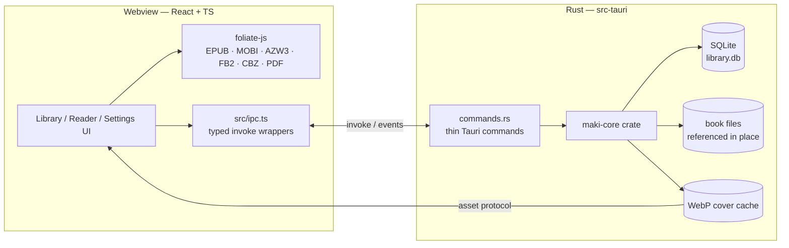
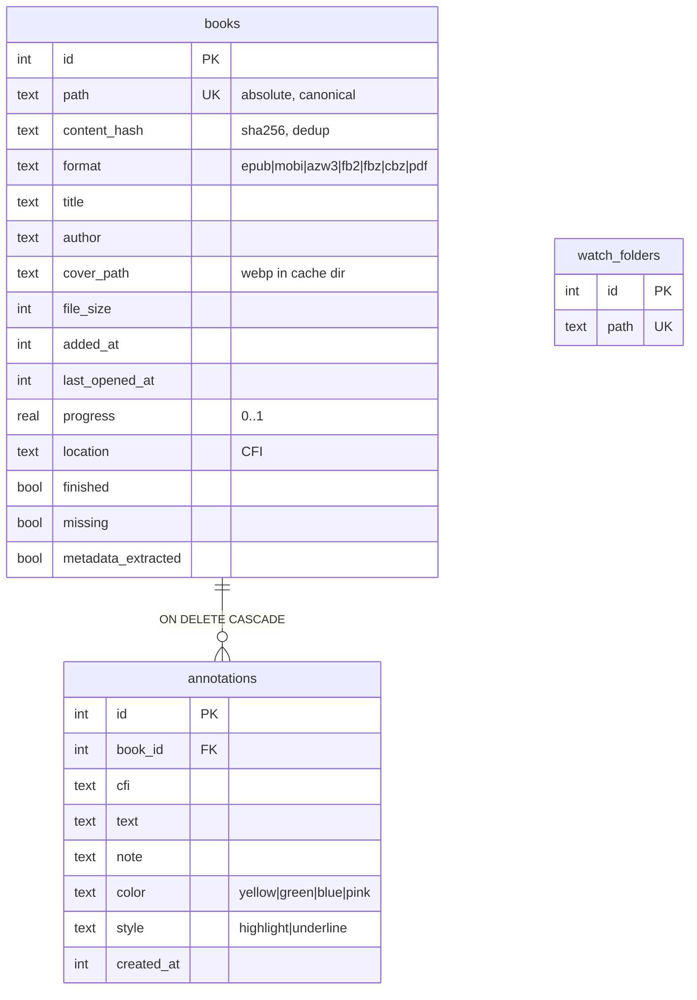

# Architecture

Maki is a Tauri 2 app: a Rust backend owning all filesystem/database work,
and a React webview owning rendering and UI.



## Crate layout

- **`src-tauri/core` (maki-core)** — database (schema + migrations), import
  SHA-256+pipeline with dedup, WebP cover caching, watch-folder scanning with
  event emission. No Tauri dependency, so `cargo test -p maki-core` runs anywhere
  (no webkit needed).
- **`src-tauri` (maki)** — Tauri commands wrapping maki-core, window
  config, plugins (dialog, opener, window-state).

## Frontend layout

```
src/
├── ipc.ts               # the single frontend/backend boundary
├── bindings/            # TS types generated from Rust models (ts-rs)
├── i18n/                # i18next resources (en, ja stub)
├── store/               # zustand stores: app (nav), library, settings
├── components/          # shared primitives (Titlebar, Dialog, Icon, …)
└── features/
    ├── library/         # grid/list, search/sort, import, metadata extraction
    ├── reader/          # foliate-view wrapper, themes, typography, TOC
    ├── annotations/     # selection popover, sidebar, Markdown export
    └── settings/
```

## IPC contract

All commands live in [`src-tauri/src/commands.rs`](../src-tauri/src/commands.rs)
and are called only through [`src/ipc.ts`](../src/ipc.ts). Shared types are
derived from the Rust structs in
[`src-tauri/core/src/models.rs`](../src-tauri/core/src/models.rs) via `ts-rs`;
regenerate with `pnpm gen-types` after changing them.

| Command | Purpose |
| --- | --- |
| `list_books` | All books; refreshes each book's `missing` flag |
| `search(query)` | FTS5 search over metadata + annotations → ranked book ids |
| `import_files(paths)` | Register files/dirs in place (hash, dedup) |
| `read_book_bytes(id)` | Raw file bytes for foliate-js (binary IPC) |
| `set_book_metadata(id, …)` | Store webview-extracted metadata |
| `save_cover(id, bytes)` | Downscale + cache cover as WebP, record path |
| `save_progress(id, location, progress)` | Persist CFI + fraction (debounced caller) |
| `mark_opened(id)` / `set_finished(id, bool)` | Bookkeeping |
| `remove_book(id, delete_file)` | Remove from library, optionally delete file |
| `list/add/update/delete_annotation` | Annotation CRUD |
| `list/add/delete_bookmark` | Bookmark CRUD (per-book jump points) |
| `list/add/remove_watch_folder` | Watch folder CRUD (restarts watcher) |
| `get_settings` / `save_settings` | `~/.config/maki/settings.json` |
| `save_text_file(path, contents)` | Annotation Markdown export (path from save dialog) |

Events: the backend emits `library-updated` with newly imported books when the
watcher or startup scan finds files.

## Database schema

SQLite at `~/.local/share/maki/library.db` (WAL). Migrations are embedded in
[`db.rs`](../src-tauri/core/src/db.rs) and run on startup;
`PRAGMA user_version` records the applied count. Append-only — never edit a
shipped migration.

Migration 2 adds FTS5 external-content tables `books_fts` (title, author) and
`annotations_fts` (text, note), kept in sync with `books`/`annotations` by
insert/update/delete triggers. `library::search` queries both and returns book
ids ranked by `bm25`, metadata matches before annotation-only matches.

Migration 3 adds `bookmarks` (book_id FK `ON DELETE CASCADE`, cfi, label) — a
lightweight per-book list of jump points, distinct from annotations.



## Data locations (strict XDG)

| What | Where |
| --- | --- |
| Settings | `$XDG_CONFIG_HOME/maki/settings.json` |
| Library DB | `$XDG_DATA_HOME/maki/library.db` |
| Cover cache | `$XDG_CACHE_HOME/maki/covers/<book-id>.webp` |

Book files are **never copied**; the library stores their absolute path and a
content hash. Missing files are flagged in the UI, not silently removed.

## Import & metadata flow

1. Rust registers the file: canonical path, SHA-256, size, format from
   extension, filename as placeholder title. Duplicate path *or* duplicate
   hash → skipped.
2. The webview notices `metadata_extracted = false`, opens the book with
   foliate-js in the background, extracts title/author/language/description
   and the cover blob, and sends them back (`set_book_metadata`, `save_cover`).
3. Rust downscales the cover to ≤480×720 and caches it as WebP; the grid loads
   it via the asset protocol.

This keeps exactly one book-parsing implementation (foliate-js) — the Rust
side never parses ebook formats.

Watch folders use `notify` with a hand-rolled 1.5 s settle debounce (files
being copied fire event storms); a startup rescan catches files added while
the app was closed.

## Decisions

- **Ambiguity rule from the brief:** when in doubt, match Apple Books.
- **One rendering pipeline for everything, including PDF.** foliate-js ships a
  pdf.js wrapper exposing the same book interface, so the reader has a single
  code path (`pdfjs-dist` was dropped). CBZ and PDF render through foliate's
  fixed-layout renderer.
- **Metadata extraction in the webview**, not Rust (per brief) — avoids a
  second parser; the cost is that covers appear a beat after import.
- **`read_book_bytes` over asset-protocol file access** for book files: books
  can live anywhere on disk, and a scoped binary IPC command avoids granting
  the webview blanket filesystem read access. Covers (app-owned cache dir) do
  use the asset protocol with a scope of `$CACHE/maki/covers/**`.
- **Reader "pages" are foliate locations** (~1500 chars), like Calibre;
  real page-list labels are used when the EPUB provides them.
- **Time-left estimates** scale foliate's fixed 1600 chars/min assumption by a
  measured chars/min tracked across sessions (`readingSpeed.ts`).
- **Dark reader themes force text colors** (`!important`) because books
  hardcode `#000`; an "override book colors" toggle can relax this later.
- **System font listing isn't possible** in WebKitGTK (no Local Font Access
  API), so "System" maps to generic families rather than an enumerated list.
- **"Look up" in the selection popover is deferred to v0.2** with the
  dictionary feature it depends on (see ROADMAP).
- **`fb2.zip` is normalized to the `fbz`** format tag on import.
- **Escape in the reader** closes popover → panels → falls back to library
  (Apple Books-like layered dismissal); F11 fullscreen hides all chrome with
  hover reveal.
